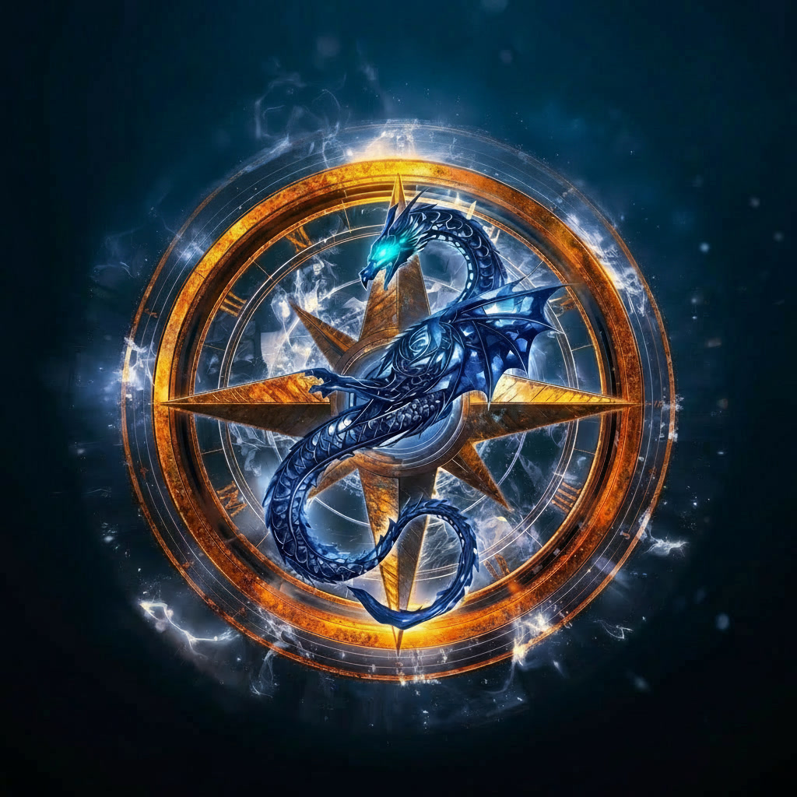
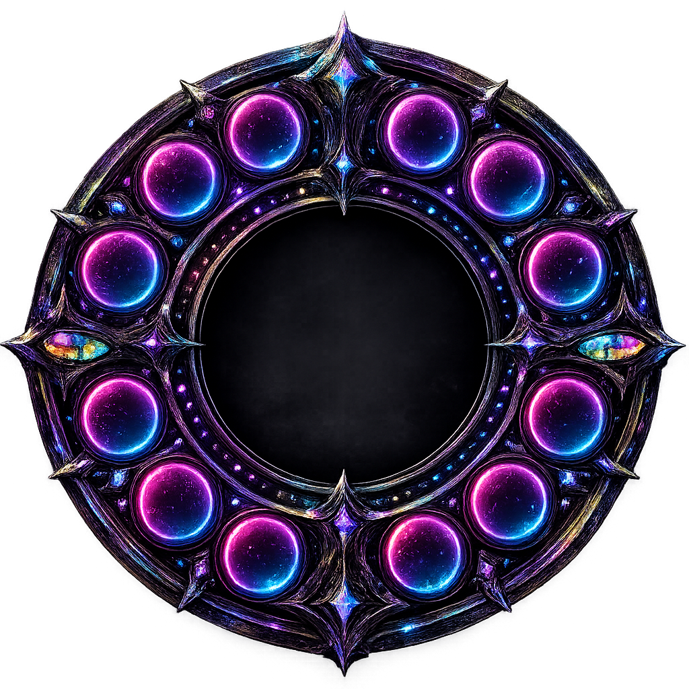

<p align="center">
  
</p>

<h1 align="center">Echoes Unseen</h1>

<p align="center"><b>An accessibility overlay for Guild Wars 2 — built voice-first for blind and low-vision players.</b></p>

<p align="center">
  
  
  
  
</p>

Echoes Unseen runs as a transparent, click-through overlay on top of Guild Wars 2. A radial HUD wheel gives you twelve tools you drive entirely by keyboard and voice — nothing requires seeing the screen. Everything is spoken aloud by a natural local voice, and the whole app runs on your own machine.

<p align="center">
  
</p>

> **Current release: B1.1** · Windows 10/11 (64-bit) · Free (donations welcome) · *more updates to come.*

---

## What it does

- **Voice-first, screen-reader native** — full NVDA support; anything on screen can be spoken, including whatever the mouse rests on.
- **The wheel, on five keys** — hold `Alt` and tap the arrow keys to move between tools (the voice names each one), `Alt+Enter` to open. Works while the game has focus.
- **Minimalist** — the wheel shrinks to just its logo while you play and unfolds when you hover it.
- **A natural local voice** — speaks with [Piper](https://github.com/rhasspy/piper). 22 English voices to preview and download; six arrive automatically on first run.
- **Chat by voice** — dictate into chat with local speech-to-text: Whisper (local AI) or the built-in Windows recognizer. Audio never leaves the PC.
- **Find any item** — searches your bank, every character's bags, and material storage through the official GW2 API, and tells you exactly where something is and how to surface it.
- **Read the screen** — `Ctrl+Shift+Space` reads whatever is under the pointer: tooltips, menu buttons, list rows.
- **Themes with sound** — seven themes, each retuning the app's audio cues as well as its colours.
- **Yours to configure** — rebind every shortcut, toggle any feature, add your own sheet music to the Music Player.

## The twelve tools

Screen Reader · Heart Quests · Trail Navigator · Chat Reader · Voice to Chat · Music Player · Oracle (GW2 Wiki) · Account Search · Trading Post · Build & Gear · Map Completion · Settings

---

## Building from source

Requires the [.NET 8 SDK](https://dotnet.microsoft.com/download) on Windows.

```bash
git clone <your-fork-url>
cd EchoesUnseen
dotnet build
dotnet run --project EchoesUnseen
```

To produce a self-contained single-file release exe (no .NET needed on the target machine):

```powershell
powershell -ExecutionPolicy Bypass -File publish-beta.ps1 -Version "B1.1"
```

## Tech

- **.NET 8 / WPF** — native Windows overlay
- **[Piper](https://github.com/rhasspy/piper)** — local neural text-to-speech (downloaded on first run)
- **[Whisper.net](https://github.com/sandrohanea/whisper.net)** — local speech-to-text
- **Windows.Media.Ocr** — on-device screen reading
- **[NAudio](https://github.com/naudio/NAudio)** — audio capture and the sonar/earcon tones
- **Guild Wars 2 API** — exact account data for the item finder

## Privacy

Everything runs locally. The only network calls are: downloading voice/speech models on demand, and — if you supply your own key — the optional GW2 API and optional ElevenLabs cloud voice. No telemetry, no accounts, nothing sent anywhere else.

## Contributing

Feedback and suggestions are genuinely welcome — especially from players who use screen readers. Open an issue with what's confusing by ear, mis-read, or missing.

## Not affiliated with ArenaNet

Guild Wars 2 is © ArenaNet, LLC. This is an unofficial community tool.

## License

Released under the MIT License — see [LICENSE](LICENSE).
