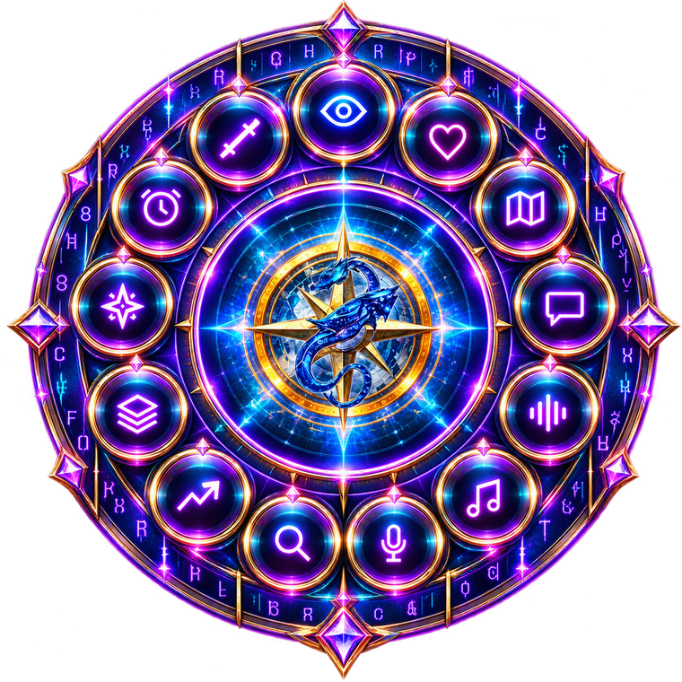

<p align="center">
  
</p>

<h1 align="center">Echoes Unseen</h1>

<p align="center"><b>An accessibility overlay for Guild Wars 2 — built voice-first for blind and low-vision players.</b></p>

<p align="center">
  
  
  
  
</p>

Echoes Unseen runs as a transparent, click-through overlay on top of Guild Wars 2. A radial HUD wheel gives you twelve tools you drive entirely by keyboard and voice — nothing requires seeing the screen. Everything is spoken aloud by a natural local voice, and the whole app runs on your own machine.

<p align="center">
  
</p>

> **Current release: b1.5** · Windows 10/11 (64-bit) · Free (donations welcome) · *more updates to come.*

---

## Download & Run

**[⬇ Download the latest release — `EchoesUnseen-b1.5.exe`](https://github.com/Quinn80/EchoesUnseen/releases/latest)**

It's **self-contained — no .NET install needed.** Download it, then run it. Windows 10/11 (64-bit).

> On first launch, Windows SmartScreen may warn "unknown publisher" (it's an unsigned indie build). Click **More info → Run anyway**. On first run it also downloads six voices automatically.

---

## What it does

- **Voice-first, screen-reader native** — full NVDA support; anything on screen can be spoken, including whatever the mouse rests on.
- **The wheel, on five keys** — hold `Alt` and tap the arrow keys to move between tools (the voice names each one), `Alt+Enter` to open. Works while the game has focus.
- **Minimalist** — the wheel shrinks to just its logo while you play and unfolds when you hover it.
- **A natural local voice** — speaks with [Piper](https://github.com/rhasspy/piper). 22 English voices to preview and download; six arrive automatically on first run.
- **Chat by voice** — dictate into chat with local speech-to-text: Whisper (local AI) or the built-in Windows recognizer. Audio never leaves the PC.
- **Find any item** — searches your bank, every character's bags, and material storage through the official GW2 API, and tells you exactly where something is and how to surface it.
- **Read the screen** — `Ctrl+Shift+Space` reads whatever is under the pointer: tooltips, menu buttons, list rows.
- **Hover Reader (beta)** — rest the mouse on something in Guild Wars 2 and hear *that one thing*: an inventory item with its tooltip, a merchant row with its own price, a whole Wizard's Vault card, a Trading Post row, a Gem Store card, a button, an NPC dialog choice. See [Hover Reader](#hover-reader-beta).
- **Themes with sound** — seven themes, each retuning the app's audio cues as well as its colours.
- **Yours to configure** — rebind every shortcut, toggle any feature, add your own sheet music to the Music Player.

## The tools on the wheel

Screen Reader · Heart Quests · Sonar Trails · Chat Reader · Voice to Chat · Music Player · Oracle (GW2 Wiki) · Account Search · Trading Post · Build & Gear · Map Completion · Event Timers · Wizard's Vault · Settings

Any of them can be hidden from the ring in **Settings → HUD**.

## Hover Reader (beta)

The Hover Reader tells you what the mouse is resting on inside Guild Wars 2. Its rule is:

**Point at one thing. Hear that one thing.**

Rather than reading the text nearest the pointer, it works out which interface object the pointer is
inside, and reads that object with its own tooltip and its own price:

| You point at | You hear |
|---|---|
| an inventory slot | the item, its tooltip, how many are in the stack |
| a merchant row | that item, its description, its own price |
| a Wizard's Vault reward | the whole card: name, description, Astral Acclaim price, availability |
| a Trading Post row | the item and its price in gold, silver and copper |
| a Gem Store card | the product, its description, its gem price, and any sale price |
| a dialog choice | that one choice, ending "Dialog option." |
| a button | "Name. Button." — anywhere on the button, not just its label |
| an NPC | that NPC's name |

Two local components do the work:

- **[OpenCV](https://opencv.org/)** — local computer vision. It reads no text; it works out the
  geometry of the interface, so the reader knows where a card, row, tooltip or button begins and ends.
- **[RapidOCR](https://github.com/RapidAI/RapidOCR)** (PP-OCRv5 models via
  [ONNX Runtime](https://onnxruntime.ai/)) — a local neural OCR model. It recognises the text inside
  that object. **Windows OCR** remains the local fallback.

> **OpenCV finds the object. RapidOCR reads the text. Echoes Unseen speaks the result.**

Both run on your PC. This is **Enhanced Hover Targeting**, on by default since b1.5; **Classic Hover
Targeting** (which reads the text nearest the pointer) is still one switch away in
**Settings → Features**.

It is **beta**: every change is measured offline against a library of recorded hovers from real
sessions before it ships, and the known limits are listed in the release notes — translucent
tooltips over cards, the odd misspelling, a pointer exactly on a row boundary, and unusual
currencies read as plain figures.

---

## Building from source

Requires the [.NET 8 SDK](https://dotnet.microsoft.com/download) on Windows.

```bash
git clone <your-fork-url>
cd EchoesUnseen
dotnet build
dotnet run --project EchoesUnseen
```

To produce a self-contained single-file release exe (no .NET needed on the target machine):

```powershell
powershell -ExecutionPolicy Bypass -File publish-beta.ps1 -Version "b1.5"
```

The end-user build is published with `-p:Distribution=true` (it shows the feedback button).

**One binary is not in this repository:** `EchoesUnseen/Resources/Ahk/AutoHotkey64.exe`, the
unmodified [AutoHotkey](https://www.autohotkey.com/) v2 64-bit executable that the Music Player runs
as a separate process for auto-play. Download it from the AutoHotkey site and place it there before
building, or remove the embedded-resource line from `EchoesUnseen.csproj` to build without auto-play.

## Tech

- **.NET 8 / WPF** — native Windows overlay
- **[RapidOCR](https://github.com/RapidAI/RapidOCR)** (via [RapidOcrNet](https://github.com/BobLd/RapidOcrNet) and [ONNX Runtime](https://onnxruntime.ai/)) — local neural OCR, the hover reader's recognition engine; **Windows.Media.Ocr** is the local fallback
- **[OpenCV](https://opencv.org/)** (via [OpenCvSharp](https://github.com/shimat/opencvsharp)) — local computer vision for hover targeting
- **[Tesseract](https://github.com/tesseract-ocr/tesseract)** — optional higher-accuracy engine for the Chat Reader
- **[Piper](https://github.com/rhasspy/piper)** — local neural text-to-speech (downloaded on first run); Windows Natural and Windows Speech are built in, ElevenLabs is optional with your own key
- **[Whisper.net](https://github.com/sandrohanea/whisper.net)** — optional local speech-to-text for Voice to Chat (the default is the speech recognition built into Windows)
- **[NAudio](https://github.com/naudio/NAudio)** — audio capture and the sonar/earcon tones
- **[AutoHotkey](https://www.autohotkey.com/)** — run as a separate process for music auto-play
- **Guild Wars 2 API** — exact account data for the item finder, the Wizard's Vault and prices
- **TacO / BlishHUD marker-pack format** — read for the guides; no packs are bundled

Full component and licence list: [THIRD-PARTY-NOTICES.md](THIRD-PARTY-NOTICES.md).

## Privacy

**Core accessibility processing runs on your computer.** The Hover Reader, the Screen Reader and the
Chat Reader capture and recognise text locally with OpenCV, RapidOCR and Windows OCR, and Piper
speaks it locally. Nothing they read is uploaded. There is no telemetry and no account.

The network is used for these things only:

- the **official Guild Wars 2 API**, with the key you supply, for account features
- the **Guild Wars 2 Wiki**, for Oracle searches and the community song library
- an **update check** against this repository's releases
- **one-time downloads** of voices and optional models (Piper, Whisper, Tesseract language data)
- **ElevenLabs**, only if you turn it on with your own key

**Bug reports are the exception, and always your choice.** Pressing the bug-record key saves a short
screen recording, recent screenshots and logs into your Downloads folder as a zip, and the
"Send feedback / crash report" button posts that zip to the project's Discord channel — only when
you press it. Reports contain no API keys, account names or email addresses, but they do contain
pictures of your own screen, which is what makes them useful.

## No gameplay automation

Echoes Unseen does not play Guild Wars 2 and makes no decisions in it. It has no generative-AI
chatbot and does no cloud analysis of your game; the local neural models it uses turn pictures into
text and text into speech. You still move, choose, buy, fight and explore. Music auto-play is an
optional instrument feature that sends the imported song's instrument key presses; it does not
control character movement, combat, story progression or dialog choices.

## Contributing

Feedback and suggestions are genuinely welcome — especially from players who use screen readers. Open an issue with what's confusing by ear, mis-read, or missing.

## Not affiliated with ArenaNet

Guild Wars 2 is © ArenaNet, LLC. This is an unofficial community tool.

## License

Released under the MIT License — see [LICENSE](LICENSE).
